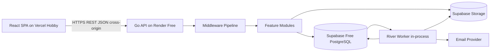

# 02. System Architecture

## 1. Architectural style

Chọn **feature-first modular monolith với lightweight Hexagonal/Clean boundaries**.

Đây không phải Clean Architecture giáo điều. Mục tiêu là:

- Domain logic không phụ thuộc HTTP.
- Application service không phụ thuộc concrete database implementation.
- SQL và framework được giữ ở adapter/infrastructure layer.
- Số interface được giữ tối thiểu; interface được định nghĩa phía consumer.
- Một feature có thể đọc được theo chiều dọc mà không phải đi qua nhiều thư mục global.

## 2. Component diagram



> **Note:** Vercel origin khác Render origin → cookie auth cần `SameSite=None; Secure` + CSRF token; CORS allowlist chính xác Vercel origins.

## 3. Runtime topology

### MVP demo: Vercel + Render Free + Supabase Free

```text
Vercel Hobby (React SPA)
        |
        | HTTPS REST JSON (cross-origin)
        v
Render Free Go service
  |- HTTP server
  |- River workers (in-process)
  |- periodic scheduler (in-process)
        |
        +--> Supabase Free PostgreSQL 15+
        +--> Supabase Storage
```

Ưu điểm:

- Zero-cost demo.
- Không quản lý VPS/CDN.
- Vercel preview branch cho review.

Hạn chế:

- Cross-origin cookie cần `SameSite=None; Secure` + CSRF.
- Render Free cold start và single-instance.
- Supabase Free giới hạn 500 MB DB, 1 GB egress, pool nhỏ.

### Scale phase: same codebase, separated processes

```text
Vercel Pro / custom domain
        |
        v
Render paid / cmd/api    -> N replicas
Render paid / cmd/worker -> M replicas
Render paid / cmd/scheduler -> exactly 1 active instance or leader-safe jobs
        |
        +--> Supabase Pro PostgreSQL
        +--> Supabase Storage / S3
```

Không tách microservice; chỉ tách process theo workload.

## 4. Request path

```text
Client
  -> Reverse proxy
  -> Request ID middleware
  -> Recovery middleware
  -> Security headers
  -> Access log
  -> CORS/origin policy
  -> Rate limit
  -> Authentication
  -> Tenant context
  -> Route handler
  -> Application service
  -> Authorization policy
  -> Repository/transaction
  -> PostgreSQL
  -> Response mapper
```

Middleware không được chứa business logic như “giáo viên có phụ trách lớp này không”. Business/resource authorization nằm trong application service hoặc authorizer được gọi bởi service.

## 5. Module boundaries

| Module | Trách nhiệm | Không được làm |
|---|---|---|
| auth | Credentials, token, refresh sessions | Quản lý class enrollment |
| users | Profile, account status | Tự quyết tenant permission |
| organizations | Tenant/membership/role assignment | Lưu grade |
| academics | Term, subject, course, class, enrollment | Chấm bài |
| resources | Metadata học liệu, visibility, file linkage | Chứa binary |
| questions | Question identity/version/bank | Tạo attempt |
| assessments | Assessment definition, publish snapshot | Ghi answer runtime |
| attempts | Runtime, answers, submit, expire | Sửa question version |
| grading | Auto/manual grading results | Công bố resource |
| assignments | Assignment/submission | Tính toàn bộ gradebook policy |
| gradebook | Grade items/entries/publication | Sửa attempt answer |
| notifications | In-app/email notification | Quyết định domain action |
| audit | Append-only audit trail | Là nguồn domain state |
| files | Object store orchestration | Business permission độc lập |
| platform | DB, HTTP, clock, config, logging | Chứa domain rules |

## 6. Dependency rules

```text
transport/http -> application -> domain
                     |
                     v
                  ports/interfaces
                     ^
                     |
              infrastructure adapters
```

Quy tắc thực tế:

1. Handler gọi application service, không gọi sqlc trực tiếp.
2. Application service có thể mở transaction.
3. Domain package chỉ chứa entity/value object/policy có invariant thực sự.
4. Repository adapter bọc sqlc, không chứa business decision.
5. Module không query bảng module khác tùy tiện; dùng public service hoặc query read model đã định nghĩa.
6. Cross-module write phải đi qua application service chủ sở hữu dữ liệu.

## 7. Transaction boundaries

Transaction bắt buộc cho:

- Create user + membership + audit.
- Publish assessment + create snapshots + audit.
- Start attempt + selected items + attempt event.
- Save answer + increment revision + event cần thiết.
- Submit attempt + terminal status + enqueue grading job.
- Manual grade + grade entry + audit.
- Publish grades + publication record + notifications jobs.

Không giữ DB transaction mở trong khi:

- Gọi object storage.
- Gọi email provider.
- Gọi external AI/API.
- Upload/download file.

Dùng state machine + background job để xử lý side effect ngoài database.

## 8. Sync vs async

### Xử lý đồng bộ

- Validation.
- Authorization.
- CRUD metadata nhỏ.
- Save answer.
- Submit state transition.
- Manual grade write.
- **MCQ/simple auto-grading trong cùng request submit** cho demo (nhanh, đơn giản).

### Xử lý async

- Essay/manual review grading.
- Email.
- Export.
- File scan/preview.
- Aggregate analytics.
- Notification fan-out lớn.
- **Auto-grade phức tạp/lớn sẽ async khi scale.**

## 9. Read model

MVP không dùng CQRS riêng. Có thể tạo:

- SQL view.
- Materialized view.
- Denormalized projection table.

Chỉ dùng cho dashboard/report. Source of truth vẫn là normalized transactional tables.

## 10. Failure model

| Failure | Hành vi |
|---|---|
| DB unavailable | Trả 503, không giả thành công |
| Job enqueue thất bại trong transaction | Rollback business transaction |
| Email provider lỗi | Retry job, không rollback grade publish |
| Object storage lỗi khi upload confirm | Resource giữ trạng thái `UPLOAD_PENDING/FAILED` |
| Auto-grading worker crash | Job retry idempotent |
| Duplicate submit | Trả trạng thái hiện tại, không tạo grade job trùng |
| Client timeout sau commit | Idempotency key cho phép retry an toàn |
