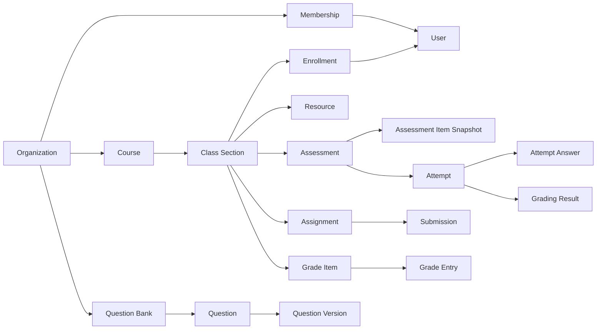

# 04. Domain Model & State Machines

## 1. Core domain map



## 2. Aggregate boundaries

### Organization

Chịu trách nhiệm:

- Tenant identity.
- Membership.
- Role assignment ở mức tổ chức.
- Organization settings.

Không chứa toàn bộ users/classes trong memory aggregate.

### Question

```text
Question (logical identity)
  |- current_version_id
  |- status
  `- QuestionVersion[]
```

Invariant:

- Version number tăng đơn điệu trong một question.
- Published version không update.
- Xóa question là archive/soft-delete nếu đã được tham chiếu.

### Assessment

```text
Assessment
  |- settings
  |- sections
  |- item rules/items
  |- publication
  `- item snapshots
```

Invariant:

- Chỉ `DRAFT` được chỉnh cấu trúc.
- Publish cần ít nhất một item và cấu hình hợp lệ.
- Sau publish, snapshot immutable.
- Có thể tạo revision/new assessment version thay vì sửa bản đang thi.

### Attempt

```text
Attempt
  |- selected snapshot items
  |- start/expires timestamps
  |- answers
  |- status
  `- events
```

Attempt là aggregate nhạy cảm, thao tác ghi cần lock/optimistic revision phù hợp.

### Grade Entry

```text
GradeEntry
  |- raw_score
  |- override_score
  |- final_score
  |- status
  `- history
```

## 3. Status models

### User status

```text
INVITED -> ACTIVE -> SUSPENDED -> ARCHIVED
```

- `ARCHIVED` không đăng nhập.
- Không hard-delete user có dữ liệu học tập.

### Enrollment status

```text
PENDING -> ACTIVE -> COMPLETED
                 \-> WITHDRAWN
```

### Resource status

```text
DRAFT -> PUBLISHED -> ARCHIVED
  \-> UPLOAD_PENDING -> PROCESSING -> READY
                           \-> FAILED
```

### Question status

```text
DRAFT -> IN_REVIEW -> APPROVED -> PUBLISHED -> ARCHIVED
```

MVP có thể dùng `DRAFT`, `PUBLISHED`, `ARCHIVED`, nhưng schema không chặn thêm review workflow.

### Assessment lifecycle dimensions

Tách thành 4 chiều trạng thái độc lập:

```text
assessment_definition_status: DRAFT | ARCHIVED
assessment_availability: SCHEDULED | OPEN | CLOSED
assessment_grading_status: NOT_STARTED | IN_PROGRESS | COMPLETED
result_release_status: HIDDEN | SCORE_RELEASED | ANSWERS_RELEASED
```

Không dùng một enum để biểu diễn đồng thời availability, grading và result publication.

### Attempt lifecycle dimensions

```text
attempt_runtime_status: CREATED | IN_PROGRESS | SUBMITTED | EXPIRED | TERMINATED
attempt_grading_status: QUEUED | AUTO_GRADED | MANUAL_REVIEW | FINALIZED
```

Terminal đối với runtime: `SUBMITTED`, `EXPIRED`, `TERMINATED`.

### Assessment status (legacy — sẽ refactor thành dimensions trên)

```text
DRAFT -> SCHEDULED -> OPEN -> CLOSED -> GRADING -> REVIEWED -> PUBLISHED -> ARCHIVED
```

Lưu ý:

- `OPEN/CLOSED` có thể được suy ra từ thời gian, nhưng vẫn cần publication state rõ.
- Không dùng cron làm nguồn duy nhất để chuyển trạng thái; request phải kiểm tra server time.

### Attempt status (legacy — sẽ refactor thành dimensions trên)

```text
CREATED -> IN_PROGRESS -> SUBMITTED -> GRADING -> FINALIZED -> PUBLISHED
                         \-> EXPIRED -> GRADING
                         \-> TERMINATED
```

Terminal đối với runtime: `SUBMITTED`, `EXPIRED`, `TERMINATED`.

### Assignment status

```text
DRAFT -> SCHEDULED -> OPEN -> CLOSED -> GRADING -> RETURNED -> ARCHIVED
```

### Submission status

```text
DRAFT -> SUBMITTED -> GRADED -> RETURNED
                    \-> RESUBMISSION_REQUESTED -> DRAFT
```

## 4. Permission model

### Role examples

- `org_admin`
- `teacher`
- `teaching_assistant`
- `student`

### Permission catalog (canonical)

Catalog duy nhất dùng chung cho backend authorization, frontend route metadata và test matrix. Convention: `resource:action`.

```text
organization:manage
organization:update
user:create
user:view
user:update
user:suspend
user:import
class:create
class:view
class:manage
class:admin
enrollment:view
resource:create
resource:view
resource:update
resource:publish
question:create
question:view
question:update
question:publish
assessment:create
assessment:view
assessment:update
assessment:publish
attempt:start
attempt:answer
attempt:submit
attempt:grade
attempt:terminate
assignment:create
assignment:view
assignment:update
assignment:grade
submission:grade
grade:view
grade:update
grade:publish
audit:view
academic:manage
admin:workspace
teacher:workspace
```

Mục tiêu: OpenAPI enum hoặc package/schema duy nhất; generate constants cho Go/TypeScript; validate route metadata trong CI.

### Permission examples (legacy — sẽ thay bằng catalog trên)

### Resource scope

Permission không đủ. Ví dụ giáo viên có `grade:update`, nhưng chỉ được cập nhật grade item thuộc lớp họ phụ trách.

Authorization decision:

```text
allow = role_has_permission
    AND resource.organization_id == context.organization_id
    AND actor_has_resource_scope
    AND resource_state_allows_action
```

## 5. Domain events

MVP không triển khai event sourcing, nhưng ghi domain event/outbox cho side effects.

Ví dụ:

```text
user.created
assessment.published
attempt.started
attempt.submitted
attempt.expired
grading.completed
grade.overridden
grades.published
resource.uploaded
```

Event chứa ID và metadata tối thiểu, không chứa toàn bộ dữ liệu nhạy cảm.

## 6. Value objects

Khuyến nghị value objects cho:

- `Score` — decimal, max score, validation.
- `TimeWindow` — opens_at, closes_at.
- `AttemptDeadline` — started_at, expires_at.
- `QuestionAnswerKey` — validated per question type.
- `Permission`.
- `FileKey` — không nhận raw path từ client.

## 7. Business policy examples

### Có được bắt đầu attempt không?

```text
assessment published
AND current server time within open window
AND student actively enrolled
AND target assignment includes student/class/group
AND attempt count < allowed attempts
AND no conflicting in-progress attempt unless resume allowed
```

### Có được xem đáp án không?

```text
attempt finalized
AND assessment result policy allows answer review
AND current time >= answer_release_at
```

### Có được sửa question version không?

```text
version.status == DRAFT
AND version is not referenced by published snapshot
AND actor has question:update within bank scope
```
