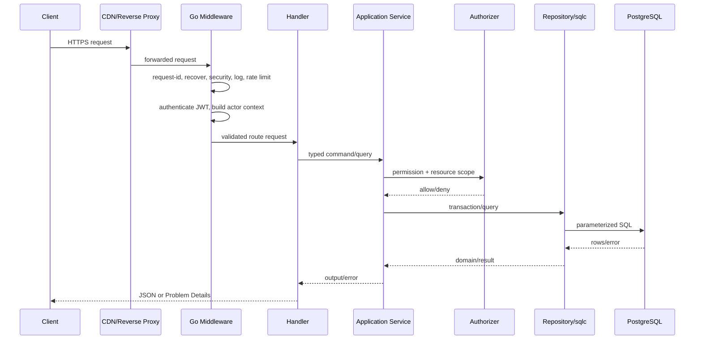
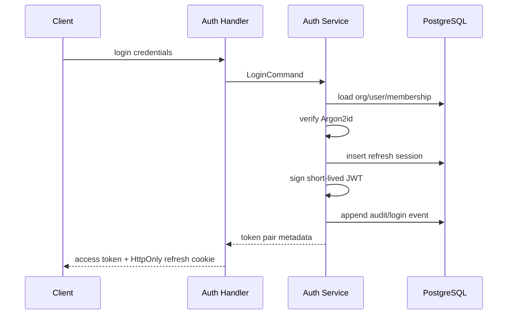
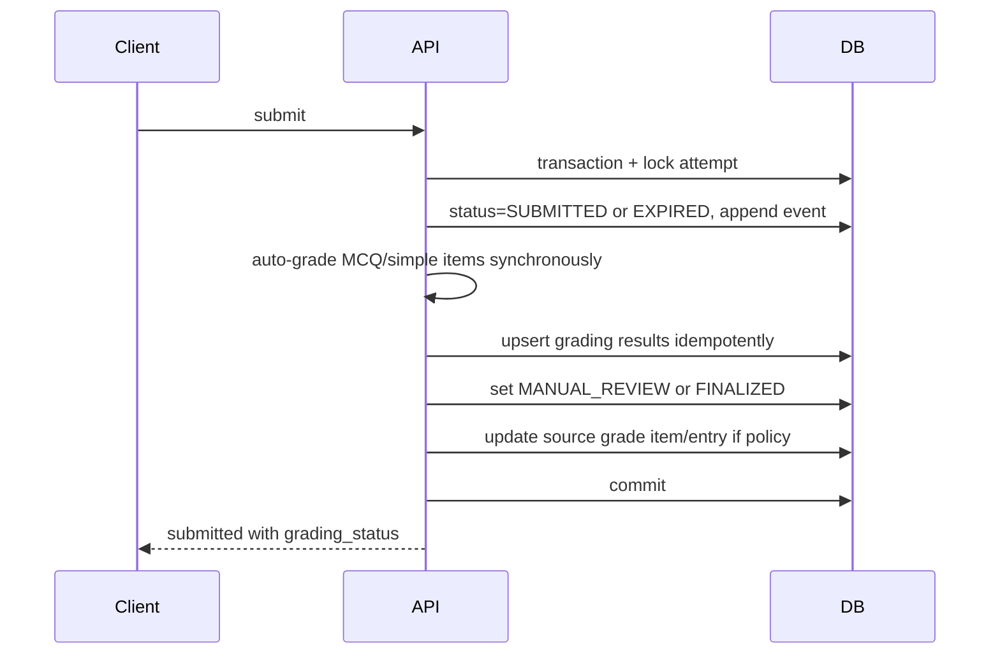
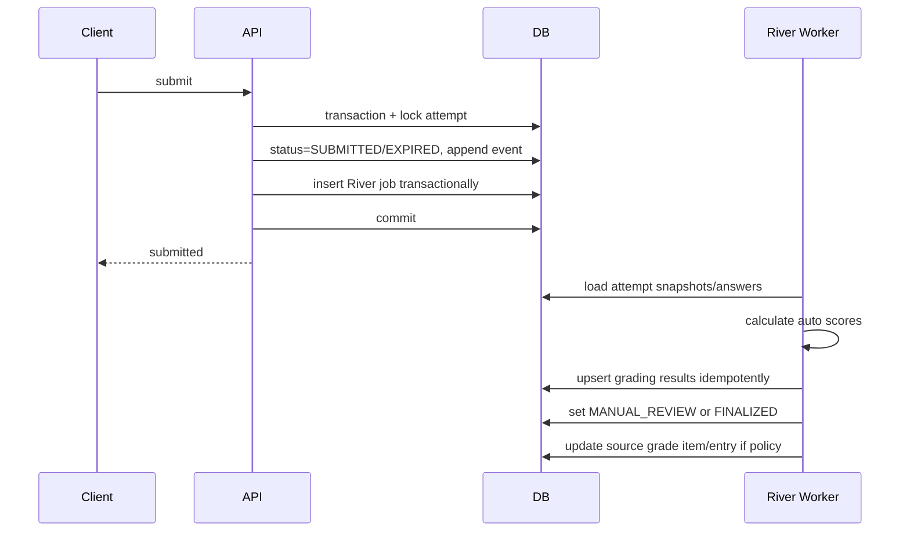

# 07. Dataflow & Processing Logic

## 1. Generic request flow



## 2. Layer responsibilities

### Middleware

- Request ID.
- Panic recovery.
- Security headers.
- Access logging.
- Body size limit.
- CORS/origin policy.
- Authentication token parsing.
- Coarse rate limiting.

Không làm:

- Query class ownership.
- Tính điểm.
- State transition.

### Handler/controller

- Bind input.
- Structural validation do Huma hỗ trợ.
- Lấy actor từ context.
- Gọi đúng use case.
- Map output.

### Application service

- Business validation.
- Authorization resource-level.
- Transaction boundary.
- Gọi domain methods.
- Repository orchestration.
- Enqueue job transactional.

### Domain

- Invariant.
- State transition.
- Pure calculation.
- Không biết HTTP/SQL.

### Repository

- sqlc calls.
- Map DB row ↔ domain/data model.
- Translate known DB errors.
- Không quyết định permission.

## 3. Authentication flow



## 4. Publish assessment flow

```text
request
-> authenticate teacher
-> load assessment scoped by org
-> authorize assessment:publish and class assignment
-> acquire assessment row lock
-> require DRAFT
-> validate schedule/settings/targets
-> resolve every fixed item and random-rule pool
-> copy immutable question/version content to snapshots
-> create publication version
-> set assessment status SCHEDULED/OPEN according to server time
-> append audit event
-> store idempotent response
-> commit
```

Nếu một question version không hợp lệ hoặc bị archive theo policy, toàn bộ publish rollback.

## 5. Start attempt flow

```text
client start request + idempotency key
-> verify token
-> load assessment publication
-> verify target/enrollment/time/max attempts
-> resolve or return existing resumable attempt
-> compute effective duration/accommodation
-> select and order snapshot items
-> insert attempt + attempt_items + event
-> persist idempotent response
-> commit
-> return server_time/expires_at/items metadata
```

## 6. Autosave flow

```text
client debounce save
-> PUT answer with expected revision
-> authenticate and verify attempt ownership
-> verify server deadline/status
-> validate payload against snapshot type
-> optimistic update/insert answer
-> return new revision + server saved_at
-> client removes local pending item only after 2xx
```

Client retry cùng expected revision sau network timeout:

- Nếu server chưa commit: update thành công.
- Nếu server đã commit: revision mismatch. API có thể so request hash/answer equality và trả current state, hoặc 409 để client fetch current answer. Khuyến nghị lưu client operation ID nhỏ trong answer event/idempotency scope nếu cần retry trong mạng yếu.

## 7. Submit & auto-grade flow

### Demo: synchronous MCQ/simple grading



Điều kiện đồng bộ:

- Tất cả item là MCQ/simple auto-grade.
- Tổng thởi gian grading < timeout request (ví dụ < 2 giây).
- Không có essay cần manual review.

Nếu không đủ điều kiện, enqueue River job và trả `grading_status=QUEUED`.

### Scale: async grading via River



## 8. File upload flow

Tách metadata transaction và network upload. Không giữ transaction khi client gửi bytes.

1. Create upload intent.
2. Client PUT trực tiếp storage.
3. Complete callback.
4. API `HEAD` object.
5. Mark processing và enqueue scan.
6. Worker scan/inspect.
7. Mark ready/rejected.

## 9. Grade publish flow

```text
teacher selects grade items
-> authorize on class
-> validate every entry status/review completeness
-> transaction:
     create grade_publication
     mark selected entries published
     enqueue notification fan-out jobs
     append audit
-> commit
-> return count
```

## 10. Error propagation

```text
pgx/sqlc error
-> repository maps known SQLSTATE
-> application maps domain error
-> HTTP layer maps to Problem Details
-> unexpected error logged with request_id
-> client receives generic 500, no internal detail
```

Examples:

| Internal error | HTTP |
|---|---|
| `domain.ErrAttemptExpired` | 409 `ATTEMPT_EXPIRED` |
| `repository.ErrNotFound` | 404 |
| unique violation username | 409 `USERNAME_EXISTS` |
| validation error | 422 |
| context deadline | 503/504 tùy layer |
