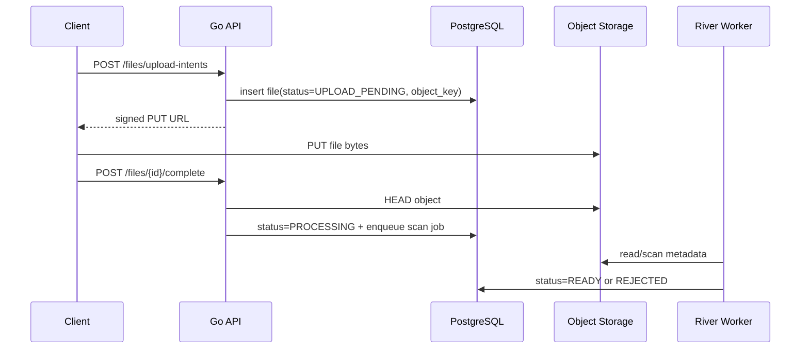

# API 03 — Resources & Files

Base path: `/api/v1`

## 1. Endpoints

| Method | URL | Description | Request Body mẫu | Response mẫu |
|---|---|---|---|---|
| GET | `/classes/{class_id}/resources` | Danh sách học liệu của lớp | — | `{"data":[{"id":"...","type":"FILE","title":"Bài 1","status":"PUBLISHED"}]}` |
| POST | `/classes/{class_id}/resources` | Tạo resource metadata | `{"type":"FILE","title":"Bài 1","folder_id":null,"publish_at":null}` | `{"data":{"id":"...","status":"DRAFT"}}` |
| GET | `/resources/{resource_id}` | Chi tiết resource (discriminated union) | — | `{"data":{"id":"...","type":"FILE","title":"Bài 1","files":[...]}}` |
| PATCH | `/resources/{resource_id}` | Cập nhật draft metadata | `{"title":"Bài 1 cập nhật"}` | `{"data":{"id":"...","version":2}}` |
| POST | `/resources/{resource_id}/publish` | Publish resource | `{"publish_at":"2026-07-01T00:00:00Z"}` | `{"data":{"status":"PUBLISHED"}}` |
| POST | `/resources/{resource_id}/archive` | Archive | `{}` | `204 No Content` |
| GET | `/resources/folders/{folder_id}` | Chi tiết folder | — | `{"data":{"id":"...","name":"Tuần 1","items":[...]}}` |
| POST | `/resources/folders` | Tạo folder | `{"class_id":"...","name":"Tuần 1","parent_folder_id":null}` | `{"data":{"id":"..."}}` |
| PATCH | `/resources/folders/{folder_id}` | Đổi tên folder | `{"name":"Tuần 1 cập nhật"}` | `{"data":{"id":"..."}}` |
| POST | `/resources/folders/{folder_id}/move` | Di chuyển folder | `{"parent_folder_id":"...","expected_version":2}` | `{"data":{"id":"..."}}` |
| POST | `/resources/folders/{folder_id}/items/reorder` | Sắp xếp lại items | `{"items":[{"resource_id":"...","position":1}]}` | `{"data":{"id":"..."}}` |
| DELETE | `/resources/folders/{folder_id}` | Xóa folder rỗng | `{"expected_version":2}` | `204 No Content` |
| POST | `/files/upload-intents` | Tạo upload intent/signed URL | `{"filename":"lesson.pdf","content_type":"application/pdf","size":1200345,"purpose":"RESOURCE"}` | `{"data":{"file_id":"...","upload_url":"https://...","expires_at":"...","required_headers":{...}}}` |
| POST | `/files/{file_id}/complete` | Xác nhận upload hoàn tất | `{"etag":"..."}` | `{"data":{"status":"PROCESSING"}}` |
| GET | `/files/{file_id}` | Metadata file | — | `{"data":{"id":"...","status":"READY","filename":"lesson.pdf"}}` |
| POST | `/files/{file_id}/download-url` | Lấy signed download URL sau authorization | `{}` | `{"data":{"url":"https://...","expires_at":"..."}}` |
| DELETE | `/files/{file_id}` | Xóa file chưa tham chiếu/archive | — | `204 No Content` |
| POST | `/resources/{resource_id}/files` | Gắn file vào resource | `{"file_id":"...","role":"PRIMARY"}` | `{"data":{"resource_id":"...","file_id":"..."}}` |
| DELETE | `/resources/{resource_id}/files/{file_id}` | Gỡ file khỏi draft | — | `204 No Content` |
| POST | `/resources/{resource_id}/view-events` | Ghi viewed/opened event có debounce | `{"event":"OPENED"}` | `202 Accepted` |

## 2. Upload flow



## 3. Validation

- Filename chỉ là display metadata; không dùng làm object key trực tiếp.
- Content length phải bằng intent trong tolerance cho phép.
- MIME type xác minh lại bằng magic bytes/processing worker.
- Extension không quyết định an toàn.
- SVG/HTML không render inline từ user upload.
- Size limit theo purpose và organization policy.

## 4. Object key format

```text
org/{organization_id}/files/{yyyy}/{mm}/{file_id}/{random_object_name}
```

Client không được gửi object key.

## 5. Resource discriminated union

Mọi resource có `type` enum: `FILE`, `LINK`, `RICH_CONTENT`, `FOLDER`.

- `FILE`: gắn `file_id` qua `resource_files`; có `files` array trong response.
- `LINK`: `url` + `open_in_new`.
- `RICH_CONTENT`: canonical body `{"format":"SANITIZED_HTML","content":"..."}` hoặc `{"format":"AST","ast":{...}}` — chốt ở P0-12.
- `FOLDER`: container cho tree; `parent_folder_id` nullable; cycle prevention bắt buộc.

## 6. Resource visibility

Resource access được xác định bằng:

- Organization scope.
- Class enrollment/teacher assignment.
- Resource target.
- Publish status/time.
- Archived status.

Signed URL chỉ cấp sau authorization; URL ngắn hạn, thường 5–15 phút.
