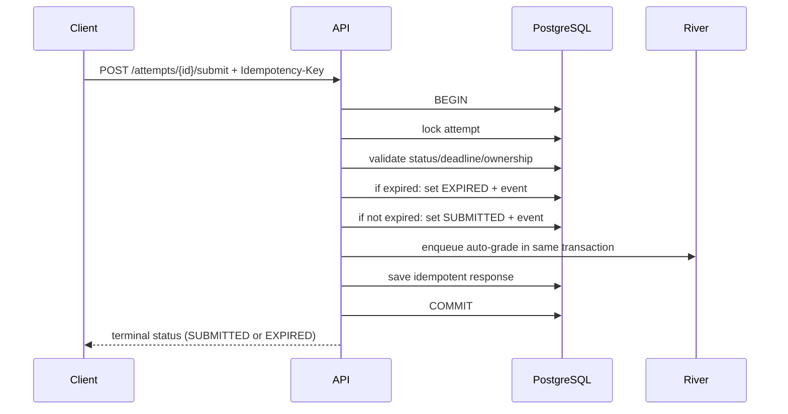

# API 05 — Assessments & Attempts

Base path: `/api/v1`

## 1. Assessment builder endpoints

| Method | URL | Description | Request Body mẫu | Response mẫu |
|---|---|---|---|---|
| GET | `/classes/{class_id}/assessments` | Danh sách assessment | — | `{"data":[{"id":"...","title":"Giữa kỳ","status":"DRAFT"}]}` |
| POST | `/classes/{class_id}/assessments` | Tạo assessment draft | `{"title":"Giữa kỳ","duration_minutes":45,"max_attempts":1}` | `{"data":{"id":"...","status":"DRAFT"}}` |
| GET | `/assessments/{assessment_id}` | Chi tiết builder/runtime policy | — | `{"data":{"id":"...","sections":[...],"settings":{...}}}` |
| PATCH | `/assessments/{assessment_id}` | Cập nhật draft settings | `{"title":"Giữa kỳ HK1","opens_at":"...","closes_at":"..."}` | `{"data":{"id":"...","revision":3}}` |
| POST | `/assessments/{assessment_id}/sections` | Tạo section | `{"title":"Trắc nghiệm","position":1}` | `{"data":{"id":"..."}}` |
| PATCH | `/assessment-sections/{section_id}` | Cập nhật section | `{"title":"Phần I","position":1}` | `{"data":{"id":"..."}}` |
| POST | `/assessment-sections/{section_id}/items` | Thêm fixed question version | `{"question_version_id":"...","points":"1.00","position":1}` | `{"data":{"id":"..."}}` |
| PATCH | `/assessment-items/{item_id}` | Sửa item/points | `{"points":"2.00","position":2}` | `{"data":{"id":"...","revision":3}}` |
| DELETE | `/assessment-items/{item_id}` | Xóa item khỏi draft | — | `204 No Content` |
| POST | `/assessment-sections/{section_id}/items/reorder` | Batch reorder items | `{"items":[{"item_id":"...","position":1}],"expected_version":2}` | `{"data":{"revision":3}}` |
| POST | `/assessment-sections/reorder` | Batch reorder sections | `{"sections":[{"section_id":"...","position":1}],"expected_version":2}` | `{"data":{"revision":3}}` |
| DELETE | `/assessment-sections/{section_id}` | Xóa section | `{"expected_version":2}` | `204 No Content` |
| POST | `/assessment-sections/{section_id}/random-rules` | Thêm random rule | `{"bank_id":"...","filters":{"tag_ids":["..."]},"pick_count":10,"points_each":"1.00"}` | `{"data":{"id":"..."}}` |
| PATCH | `/assessment-random-rules/{rule_id}` | Sửa random rule | `{"pick_count":12}` | `{"data":{"id":"...","revision":3}}` |
| DELETE | `/assessment-random-rules/{rule_id}` | Xóa random rule | `{"expected_version":2}` | `204 No Content` |
| POST | `/assessments/{assessment_id}/targets` | Gán class/group/user target | `{"target_type":"CLASS","target_id":"..."}` | `{"data":{"id":"..."}}` |
| DELETE | `/assessments/{assessment_id}/targets/{target_id}` | Gỡ target | — | `204 No Content` |
| POST | `/assessments/{assessment_id}/accommodations` | Điều chỉnh theo học sinh | `{"student_user_id":"...","extra_time_minutes":15}` | `{"data":{"id":"..."}}` |
| PATCH | `/assessments/{assessment_id}/accommodations/{accommodation_id}` | Sửa accommodation | `{"extra_time_minutes":30}` | `{"data":{"id":"...","revision":2}}` |
| DELETE | `/assessments/{assessment_id}/accommodations/{accommodation_id}` | Gỡ accommodation | — | `204 No Content` |
| POST | `/assessments/{assessment_id}/validate` | Validate trước publish | `{}` | `{"data":{"valid":false,"errors":[...]}}` |
| POST | `/assessments/{assessment_id}/publish` | Snapshot và publish | `{}` + `Idempotency-Key` | `{"data":{"publication_id":"...","status":"SCHEDULED"}}` |
| POST | `/assessments/{assessment_id}/close` | Đóng sớm | `{"reason":"teacher_closed"}` | `{"data":{"status":"CLOSED"}}` |
| POST | `/assessments/{assessment_id}/archive` | Archive sau khi kết thúc | `{}` | `204 No Content` |
| GET | `/assessments/{assessment_id}/results` | Summary kết quả cho giáo viên | — | `{"data":{"submitted":40,"pending_review":5,"average_score":"7.25"}}` |

## 2. Student attempt endpoints

| Method | URL | Description | Request Body mẫu | Response mẫu |
|---|---|---|---|---|
| GET | `/me/assessments` | Assessments học sinh được phép xem | — | `{"data":[{"id":"...","availability":"OPEN","attempts_used":0}]}` |
| GET | `/me/teaching/assessments` | Giáo viên xem assessments của mình | — | `{"data":[{"id":"...","title":"Giữa kỳ","status":"SCHEDULED"}],"page":{...}}` |
| GET | `/me/teaching/assignments` | Giáo viên xem assignments của mình | — | `{"data":[{"id":"...","title":"Bài tập 1","status":"OPEN"}],"page":{...}}` |
| POST | `/assessments/{assessment_id}/attempts` | Start hoặc resume policy | `{}` + `Idempotency-Key` | `{"data":{"attempt_id":"...","status":"IN_PROGRESS","server_time":"...","expires_at":"..."}}` |
| GET | `/attempts/{attempt_id}` | Lấy runtime attempt và items | — | `{"data":{"id":"...","status":"IN_PROGRESS","items":[...],"answers":{...}}}` |
| PUT | `/attempts/{attempt_id}/answers/{attempt_item_id}` | Upsert answer với revision | `{"expected_revision":4,"client_mutation_id":"uuid","answer":{"type":"SINGLE_CHOICE","choice_ids":["c1"]}}` | `{"data":{"attempt_item_id":"...","acknowledged_client_mutation_id":"uuid","revision":5,"saved_at":"..."}}` |
| POST | `/attempts/{attempt_id}/heartbeat` | Đồng bộ server time/status | `{"last_known_revision":12}` | `{"data":{"server_time":"...","expires_at":"...","status":"IN_PROGRESS"}}` |
| POST | `/attempts/{attempt_id}/submit` | Submit idempotent | `{"final_answer_revisions":{"item1":5}}` + `Idempotency-Key` | `{"data":{"status":"SUBMITTED","submitted_at":"...","grading_status":"QUEUED"}}` |
| GET | `/attempts/{attempt_id}/result` | Xem result theo release policy | — | `{"data":{"status":"PUBLISHED","score":"8.50","max_score":"10.00","items":[...]}}` |
| POST | `/attempts/{attempt_id}/terminate` | Giáo viên/admin kết thúc bắt buộc | `{"reason":"policy_violation"}` | `{"data":{"status":"TERMINATED"}}` |
| GET | `/assessments/{assessment_id}/attempts` | Giáo viên xem attempt list | — | `{"data":[{"id":"...","student":{...},"status":"SUBMITTED"}]}` |
| GET | `/attempts/{attempt_id}/timeline` | Audit/runtime timeline cho giáo viên | — | `{"data":[{"event":"STARTED","at":"..."}]}` |
| GET | `/attempts/{attempt_id}/review-bundle` | Lấy review bundle cho manual grading | — | `{"data":{"attempt_id":"...","items":[{"attempt_item_id":"...","question_snapshot":{...},"student_answer":{...}}],"grading_status":"..."}}` |
| PATCH | `/attempts/{attempt_id}/answers/{attempt_item_id}/grade` | Lưu draft score/feedback | `{"expected_version":2,"score":"8.50","feedback":"...","rubric_scores":[]}` | `{"data":{"attempt_item_id":"...","version":3,"saved_at":"..."}}` |
| POST | `/attempts/{attempt_id}/finalize-grades` | Finalize manual grades | `{"expected_version":3}` + `Idempotency-Key` | `{"data":{"grading_status":"FINALIZED","finalized_at":"..."}}` |

## 3. Start attempt algorithm

Trong transaction:

```text
1. Load assessment publication và lock candidate control rows cần thiết.
2. Verify target, active enrollment, time window, max attempts.
3. Tìm in-progress attempt có thể resume; nếu có, trả lại theo policy.
4. Resolve accommodation.
5. Resolve fixed/random item snapshots.
6. Shuffle deterministic bằng seed lưu trong attempt.
7. Insert attempt, attempt_items, STARTED event.
8. Commit.
```

Random selection phải:

- Chốt: publish-time pool snapshot + start-time deterministic selection từ eligible snapshot.
- Lưu seed và algorithm version trong attempt.
- Lưu item ID thực tế vào `attempt_items`.
- Không random lại khi resume.

## 4. Save answer algorithm

SQL concept:

```sql
UPDATE attempt_answers
SET answer_payload = $answer,
    revision = revision + 1,
    answered_at = $now,
    updated_at = $now
WHERE organization_id = $org
  AND attempt_id = $attempt
  AND attempt_item_id = $item
  AND revision = $expected_revision
RETURNING revision, updated_at;
```

Nếu chưa có answer, insert với expected revision 0, trả revision 1. Conflict trả 409 kèm `current_revision` nếu policy cho phép. Retry cùng `client_mutation_id` và cùng payload trả lại acknowledgement cũ, không tăng revision lần nữa. Cùng mutation ID nhưng payload khác trả 409/422.

Trước write:

- Attempt thuộc actor và org.
- Status `IN_PROGRESS`.
- Server time chưa quá grace deadline.
- Item thuộc attempt.
- Answer payload structurally valid theo snapshot type (discriminated union).

## 5. Submit algorithm



Submit và expire dùng chung một endpoint `POST /attempts/{attempt_id}/submit`. Server kiểm tra clock: nếu còn hạn trả `SUBMITTED`; nếu quá hạn, atomic chuyển `EXPIRED`, enqueue grading và trả terminal status. Client không cần một route "expire" riêng.

Duplicate submit:

- Nếu request/key giống: trả response đã lưu.
- Nếu attempt đã submitted nhưng key khác: trả current terminal state 200 với trạng thái hiện tại để retry thân thiện.

## 6. Expiry

Không phụ thuộc cron để bảo đảm đúng:

- Mọi read/write runtime kiểm tra `expires_at` theo server time.
- `POST /attempts/{attempt_id}/submit` cũng là endpoint expire: nếu quá hạn và status còn `IN_PROGRESS`, request chuyển atomic sang `EXPIRED` và enqueue grading.
- Background sweep job xử lý attempts không còn request từ client.

## 7. Grading result release

Kết quả trả cho học sinh phụ thuộc:

- `score_release_policy`.
- `answer_release_policy`.
- Manual review đã hoàn thành.
- Assessment publication state.
